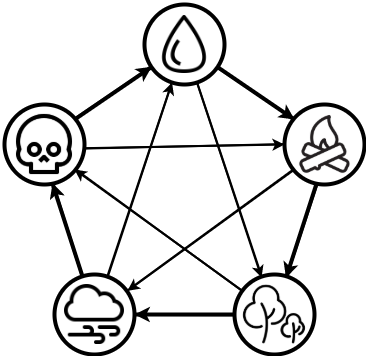

# Elemental Monsters

A simple monster battler using a 5 element rock, paper, scissor inspired system.  The element count is configurable based upon the elements listed in dmgmodifiers.csv.  The elements currently in use are:

- Water
- Fire
- Earth
- Wind
- Death

A visual representation of their interation is below:

## TODO

 - [ ] Draw if missed three times in a row by both monsters *May no longer be necessary?*
 - [ ] Save / Load
 - [ ] Buff implementation
 - [x] Block 0 health pets from going to hunt
 - [x] Make initial monster selection and stables view consistent

 - [x] Complete re-implementation of combat system
